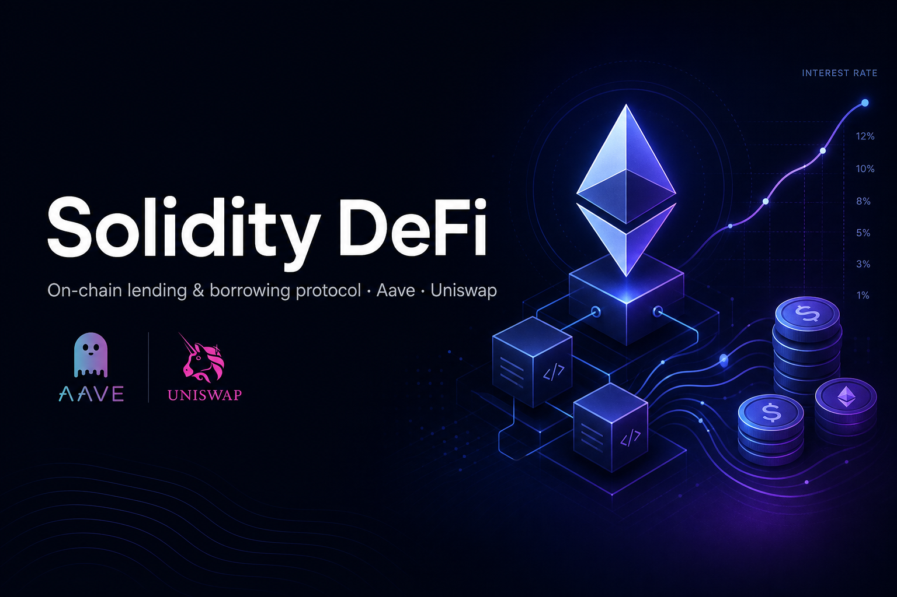

<div align="center">



<h1>Solidity DeFi - Lending &amp; Borrowing Protocol</h1>

<p><b>A minimal, transparent on-chain lending protocol in Solidity: deposit ETH to earn yield, borrow against it up to 80% LTV, with automated liquidation and a usage-based interest-rate model.</b></p>

<p>
  
  
  
  
  
</p>

</div>

---

## Overview

Most lending protocols are powerful but hard to reason about. **Solidity DeFi** is a compact implementation of the core mechanics - interest-bearing deposits, collateralized borrowing, liquidation, and a reserve - so the moving parts are easy to read and study.

Depositors supply ETH and receive **bEther**, a yield-bearing token. Under the hood, deposited ETH is routed into **Aave** to earn interest while it waits to be borrowed or withdrawn. Borrowers post collateral and can borrow up to **80% LTV**; if a position crosses that threshold, it is liquidated - the collateral is swapped via **Uniswap** and the proceeds flow to the protocol reserve.

> Built for study/research. The economic model is inspired by Compound and Anchor and is intentionally simplified.

## How It Works

- **Deposit** - supply ETH, receive interest-bearing `bEther`
- **Yield routing** - underlying ETH is deposited into Aave's lending pool to earn interest
- **Borrow** - use `bEther` as collateral and borrow up to **80% LTV**
- **Liquidation** - positions above the LTV limit are liquidated; collateral is swapped to stable value via Uniswap into the reserve
- **Reserve** - accrues a share of interest, acting as the protocol's safety buffer
- **Interest-rate model** - borrow/deposit rates flex with the **utilization ratio**: low usage lowers rates to attract borrowers; high usage raises them to attract deposits

### Exchange rate

```
exchangeRate = (getCash() + totalBorrows() - totalReserves()) / totalSupply()
```

Each `bEther` becomes redeemable for an increasing amount of ETH as interest accrues.

## Contracts

| File | Responsibility |
| --- | --- |
| `contracts/BondToken.sol` | Core lending logic - deposits, borrows, collateral, liquidation, reserve, `bEther` (ERC-20) |
| `contracts/Math.sol` | Fixed-point math helpers for rates and exchange-rate calculations |
| `contracts/interfaces/ISwapRouter.sol` | Uniswap swap-router interface used for liquidation |

**Integrations:** OpenZeppelin (`ERC20Burnable`, `Ownable`), Aave (`ILendingPool`, `IWETHGateway`), Uniswap (`ISwapRouter`), Chainlink (`AggregatorV3Interface` price feeds).

## Tech Stack

`Solidity ^0.8.7` · `Hardhat` · `TypeScript` · `Ethers.js` · `OpenZeppelin` · `Aave` · `Uniswap` · `Chainlink`

## Getting Started

### Prerequisites

- Node.js and npm
- An Ethereum RPC/testnet endpoint and a funded testnet account

### Install

```bash
git clone https://github.com/yuto-kazuma/solidity-defi.git
cd solidity-defi
npm install
cp .env.example .env   # add your RPC URL, private key, and Etherscan key
```

### Test

```bash
npm test          # runs the Hardhat test suite (gas report enabled)
```

### Deploy &amp; Verify

```bash
npm run deploy                       # deploy to the configured network
npm run verify "<CONTRACT_ADDRESS>"  # verify on Etherscan
```

> The external addresses (Aave, Uniswap, WETH gateway) are configured for a testnet. Update them in the contract before deploying to another network.

## Disclaimer

This code is for educational and research purposes only. It has not been audited and is not intended for production or mainnet use. Interacting with DeFi contracts carries financial risk.

## License

See repository for license details.

---

<div align="center">
  <sub>Built by <a href="https://github.com/yuto-kazuma">Yuto Kazuma</a> · <a href="https://yuto-kazuma.vercel.app/">Portfolio</a></sub>
</div>
